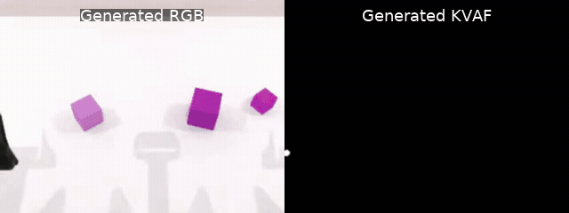
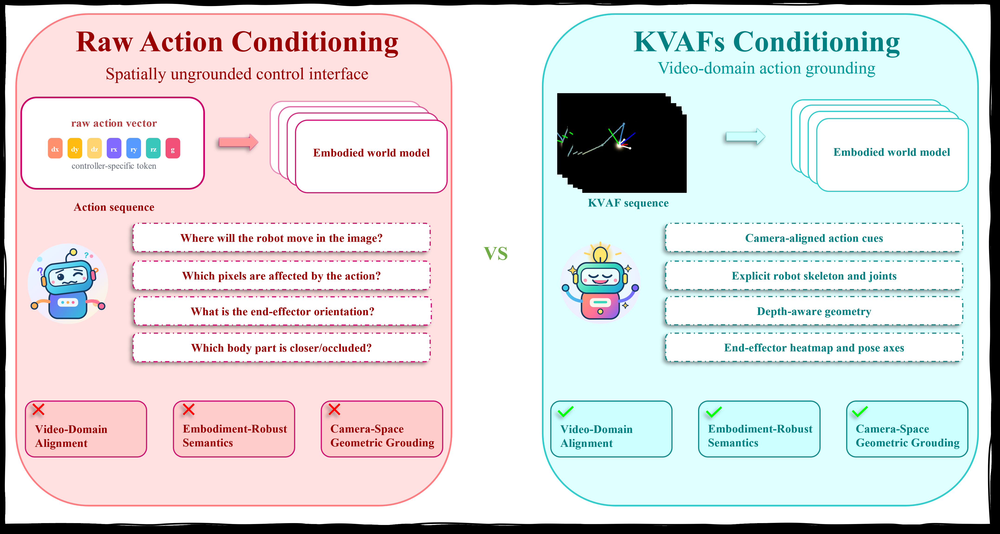
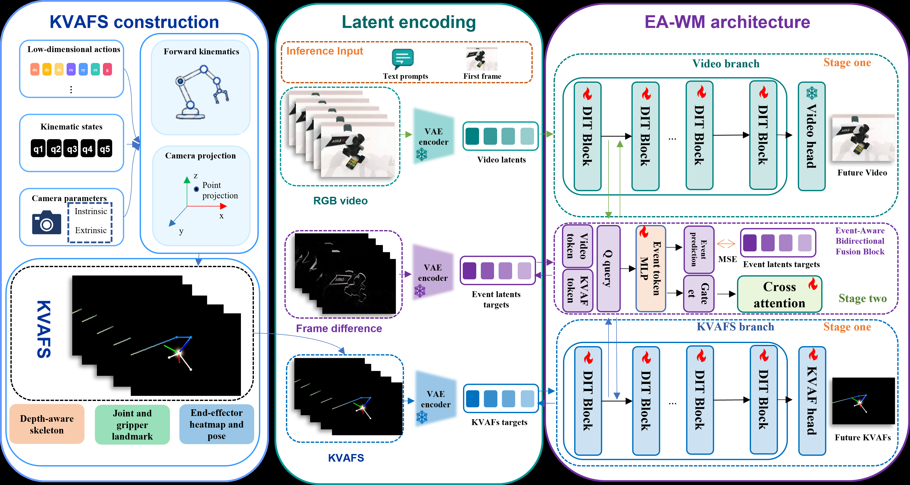
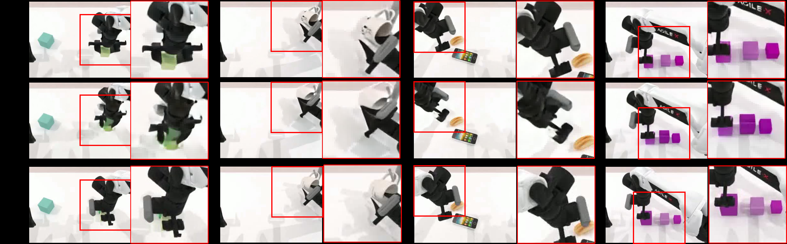
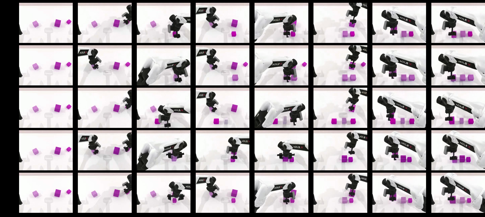

<div align="center">

# EA-WM

### Event-Aware Generative World Model with Structured Kinematic-to-Visual Action Fields

Zhaoyang Yang<sup>1,3</sup> · Yurun Jin<sup>3,4</sup> · Lizhe Qi<sup>1*</sup> · Kai Chen<sup>2,3,5*†</sup> · Cong Huang<sup>2,3*</sup>

<sup>1</sup>Fudan University · <sup>2</sup>Zhongguancun Academy · <sup>3</sup>Zhongguancun Institute of Artificial Intelligence<br>
<sup>4</sup>University of Science and Technology of China · <sup>5</sup>DeepCybo

[](https://arxiv.org/abs/2605.06192)
[](https://huggingface.co/shown21/EA-WM)
[](https://huggingface.co/Wan-AI/Wan2.2-TI2V-5B)
[](LICENSE)

**Action-consistent robot video generation through camera-aligned KVAFs and event-aware bidirectional fusion.**



</div>

## 📰 News

- **2026-09-23:** Training code, inference code, KVAF construction tools, and Stage 1/Stage 2 checkpoints are released.
- **2026-05:** EA-WM preprint is available on arXiv.

## ✨ Highlights

- **Structured visual actions.** KVAFs lift joint states, gripper states, end-effector poses, and camera geometry into temporally aligned visual fields.
- **Dual-stream generation.** RGB and KVAF latents are jointly denoised by a Wan2.2-based video stream and a full-depth KVAF stream.
- **Event-aware interaction.** Sparse bidirectional cross-attention is gated by motion and interaction events learned with Event-Difference Latent Supervision (EDLS).
- **Strong embodied-world modeling.** EA-WM reaches a **76.60 P3CScore** on the selected WorldArena metrics.

<div align="center">
  
</div>

## 🧠 Method

EA-WM starts from an initial RGB frame and a text instruction. During training, the RGB sequence and its corresponding KVAF sequence are encoded by the shared Wan VAE and independently noised. The RGB stream retains the original Wan2.2-TI2V-5B DiT, while a full-depth copied DiT models the KVAF stream. Every `context_interval` blocks, an event-aware fusion module lets each stream attend to the other at matching frame locations.

The event module predicts a gate and an event latent from both streams. EDLS supervises that latent with VAE-encoded absolute frame differences, focusing cross-stream exchange on motion and robot–object interaction changes. The objective combines RGB flow matching, KVAF flow matching, and EDLS:

```text
L = w(t) · (L_RGB + L_KVAF) + λ_event · L_EDLS
```

<div align="center">
  
</div>

Training uses two stages:

1. **Stage 1 — stream stabilization:** freeze event-aware fusion; train the main-DiT LoRA, KVAF-branch LoRA, and KVAF prediction head.
2. **Stage 2 — event-aware fusion:** initialize/unfreeze the bidirectional fusion modules and continue from the Stage 1 checkpoint.

## 📊 Results

Selected WorldArena metrics are normalized to `[0, 1]`; higher is better. P3CScore averages the six metrics and multiplies the result by 100.

| Model | Interaction ↑ | Trajectory ↑ | Depth ↑ | Perspectivity ↑ | Instruction ↑ | Semantic ↑ | P3CScore ↑ |
|:--|--:|--:|--:|--:|--:|--:|--:|
| Wan 2.2 | 0.518 | 0.163 | 0.777 | 0.766 | 0.538 | 0.888 | 60.83 |
| CogVideoX | 0.594 | 0.353 | 0.910 | 0.783 | 0.727 | **0.898** | 71.08 |
| **EA-WM** | **0.682** | **0.430** | **0.959** | **0.838** | **0.792** | 0.895 | **76.60** |

<div align="center">
  
  <br>
  
</div>

## 📦 Repository layout

```text
EA-WM/
├── configs/                  # Metadata and inference-task examples
├── diffsynth/
│   └── extensions/eawm.py   # KVAF branch, event-aware fusion, losses, generation
├── inference/generate.py    # Multi-GPU task-sharded inference
├── scripts/
│   ├── train_stage1.sh
│   ├── train_stage2.sh
│   └── infer.sh
├── tools/
│   ├── build_kvaf.py        # URDF/FK/camera-projection KVAF renderer
│   └── normalize_checkpoint.py
└── training/train_eawm.py   # Two-stage distributed training entry point
```

## ⚙️ Environment

The released code was tested with Python 3.10, PyTorch 2.5.1, CUDA 12.1, and NVIDIA H100 80 GB GPUs. The paper trains on 32 H100 GPUs with a global batch size of 32. The reported inference profile uses one A100-SXM4-80GB GPU at `480 × 640`, 81 frames, and 50 denoising steps.

```bash
git clone https://github.com/Shownx-c/EA-WM.git
cd EA-WM

conda create -n eawm python=3.10 -y
conda activate eawm

pip install torch==2.5.1 torchvision==0.20.1 torchaudio==2.5.1 \
  --index-url https://download.pytorch.org/whl/cu121
pip install -r requirements.txt
pip install -e . --no-deps
```

Set a local model cache. With `DIFFSYNTH_DOWNLOAD_SOURCE=huggingface`, missing Wan files are downloaded automatically on first use.

```bash
export DIFFSYNTH_MODEL_BASE_PATH="$PWD/models"
export DIFFSYNTH_DOWNLOAD_SOURCE=huggingface
```

To download the base model explicitly:

```bash
hf download Wan-AI/Wan2.2-TI2V-5B \
  --include "diffusion_pytorch_model*.safetensors" \
            "models_t5_umt5-xxl-enc-bf16.pth" \
            "Wan2.2_VAE.pth" \
  --local-dir models/Wan-AI/Wan2.2-TI2V-5B
```

## 🦾 Build KVAFs

`tools/build_kvaf.py` reads per-frame robot states, camera intrinsics/extrinsics, an embodiment configuration, and its URDF. It applies forward kinematics, projects the arm geometry into the head-camera view, and renders depth-aware skeletons, joint landmarks, grippers, end-effector heatmaps, and pose axes.

Expected raw episode layout:

```text
ROBOTWIN_ROOT/
└── task_name/
    └── aloha-agilex_clean_50/
        └── data/
            └── episode0.hdf5
```

Batch construction with the rendering settings used for this release:

```bash
python tools/build_kvaf.py \
  --dataset-root /path/to/RoboTwin/data \
  --urdf /path/to/aloha-agilex/urdf/arx5_description_isaac.urdf \
  --config /path/to/aloha-agilex/config.yml \
  --left-yaml /path/to/aloha-agilex/curobo_left.yml \
  --right-yaml /path/to/aloha-agilex/curobo_right.yml \
  --output-format frames \
  --output-subdir kvaf \
  --depth-range-mode absolute \
  --depth-min-m 0.05 \
  --depth-max-m 0.7 \
  --continue-on-error \
  --overwrite
```

The default training-ready output is:

```text
task_name/aloha-agilex_clean_50/kvaf/episode0/frame_0000.png
task_name/aloha-agilex_clean_50/kvaf/episode0/frame_0001.png
...
```

Use `--output-format both` to save an MP4 beside each frame directory for visual inspection.

## 🗂️ Dataset metadata

Training metadata is a CSV with four columns:

| Column | Meaning |
|:--|:--|
| `video` | RGB episode video, relative to `--dataset_base_path` |
| `action_path` | Per-frame 14-D action CSV; retained by the dataset reader |
| `kvaf_path` | KVAF frame directory, relative to `--dataset_base_path` |
| `prompt` | Text instruction |

See [`configs/metadata.example.csv`](configs/metadata.example.csv). Each RGB sequence and KVAF directory must contain the same temporal span; the released setup uses 81 frames at `480 × 640`.

## 🚀 Training

### What each stage argument means

The paper specifies LoRA rank `32`, a learning rate of `8e-5` for all trainable components, 32 H100 GPUs, and a global batch size of 32. It does **not** prescribe the Stage 1 epoch count, dataset repeat, warmup length, or EDLS weight as universal settings. The Stage 1 launcher therefore asks you to set these values explicitly.

| Argument | Meaning |
|:--|:--|
| `num_epochs` | Number of epochs executed by the current run |
| `stage1_epochs` | Epochs with fusion frozen; setting it equal to `num_epochs` produces a Stage 1-only run |
| `learning_rate` | Fallback/base optimizer learning rate |
| `lora_learning_rate` | Main RGB-branch LoRA learning rate |
| `context_learning_rate` | Bidirectional fusion and KVAF-head learning rate |
| `context_block_learning_rate` | KVAF-branch LoRA learning rate |
| `event_loss_weight` | `λ_event`, the multiplier on EDLS |
| `context_interval` | Number of DiT blocks between fusion insertions; `5` gives six fusion locations over 30 blocks |
| `resume_dit_checkpoint` | Combined Stage 1 checkpoint loaded before Stage 2 |

### Stage 1

Fill the values appropriate for your training schedule. The launcher sets `stage1_epochs=num_epochs`, so fusion remains frozen throughout this run.

```bash
export DATASET_ROOT=/path/to/RoboTwin2.0_dataset/dataset
export METADATA_PATH=/path/to/train_metadata.csv
export OUTPUT_DIR=outputs/train/stage1

export NUM_EPOCHS=<STAGE1_EPOCHS>
export DATASET_REPEAT=<DATASET_REPEAT>
export TRAINING_LR=<LEARNING_RATE>
export EVENT_LOSS_WEIGHT=<EDLS_WEIGHT>
export LR_WARMUP_STEPS=<WARMUP_STEPS>

bash scripts/train_stage1.sh
```

`LORA_LR`, `FUSION_LR`, and `KVAF_BRANCH_LR` default to `TRAINING_LR`; export them separately only when intentionally using different parameter-group rates. Checkpoints are saved after every epoch. The released `stage1.safetensors` is the normalized `epoch-4` checkpoint.

### Stage 2

Stage 2 resumes from a Stage 1 checkpoint, sets `stage1_epochs=0`, and trains event-aware bidirectional fusion from the beginning of the resumed run. The launcher contains the release configuration: 8 epochs, dataset repeat 10, cosine scheduling, 100 warmup steps, LoRA rank 32, learning rate `8e-5` for the trainable EA-WM groups, and EDLS weight `0.1`.

```bash
export DATASET_ROOT=/path/to/RoboTwin2.0_dataset/dataset
export METADATA_PATH=/path/to/train_metadata.csv
export STAGE1_CHECKPOINT=weights/stage1.safetensors
export OUTPUT_DIR=outputs/train/stage2

bash scripts/train_stage2.sh
```

For multi-node training, set the launcher variables on every node before running either script:

```bash
export NNODES=4
export NPROC_PER_NODE=8
export NODE_RANK=<0_TO_3>
export MASTER_ADDR=<RANK_0_HOST>
export MASTER_PORT=29500
```

The optimizer uses one process per GPU. With 32 GPUs and no gradient accumulation, the effective global batch size is 32.

## 🤗 Checkpoints

```bash
hf download shown21/EA-WM \
  stage1.safetensors stage2.safetensors \
  --local-dir weights
```

| File | Source | Contents | Use |
|:--|:--|:--|:--|
| `stage1.safetensors` | selected `epoch-4` | Main LoRA + KVAF-branch LoRA + KVAF head | Resume Stage 2 |
| `stage2.safetensors` | selected `epoch-7` | Stage 1 components + event-aware fusion | Inference / evaluation |

The files contain EA-WM adapters and branch parameters only. Wan2.2-TI2V-5B is downloaded separately.

## 🎬 Inference

Create a task list from [`configs/inference_tasks.example.json`](configs/inference_tasks.example.json). `video_path` (or `input_image`) supplies the initial RGB frame. The main EA-WM configuration jointly samples future RGB and KVAF latents from noise, so `kvaf_path` is optional unless reference-KVAF conditioning is enabled.

### Joint RGB + KVAF generation

```bash
export CHECKPOINT=weights/stage2.safetensors
export TASK_JSON=configs/inference_tasks.example.json
export OUTPUT_ROOT=outputs/inference/joint_generation

bash scripts/infer.sh
```

The release settings are `480 × 640`, 81 frames, 50 denoising steps, RGB/KVAF CFG `5.0`, seed `1 + task_index`, tiled VAE processing, and 15 FPS output.

### Reference-KVAF conditioned generation

Set `kvaf_path` in every task entry and enable:

```bash
export USE_REFERENCE_KVAF=1
bash scripts/infer.sh
```

Each process handles task indices satisfying `task_index % WORLD_SIZE == RANK`; increasing `NPROC_PER_NODE` parallelizes independent samples rather than splitting a single sample.

Generated files are written to:

```text
outputs/inference/
├── videos/       # RGB rollouts
└── kvaf_videos/  # jointly generated or reference-conditioned KVAF rollouts
```

## 🙏 Acknowledgements

This project builds on [Wan2.2-TI2V-5B](https://huggingface.co/Wan-AI/Wan2.2-TI2V-5B), [DiffSynth-Studio](https://github.com/modelscope/DiffSynth-Studio), [RoboTwin 2.0](https://github.com/RoboTwin-Platform/RoboTwin), and [WorldArena](https://github.com/WorldArena-Benchmark/WorldArena). We thank their authors for releasing their work.

## 📚 Citation

```bibtex
@article{yang2026eawm,
  title   = {EA-WM: Event-Aware Generative World Model with Structured Kinematic-to-Visual Action Fields},
  author  = {Yang, Zhaoyang and Jin, Yurun and Qi, Lizhe and Chen, Kai and Huang, Cong},
  journal = {arXiv preprint arXiv:2605.06192},
  year    = {2026}
}
```

## 📄 License

The code is released under the [Apache License 2.0](LICENSE). The EA-WM checkpoints are designed for Wan2.2-TI2V-5B; please also follow the base model's license and the licenses of any datasets you use.
